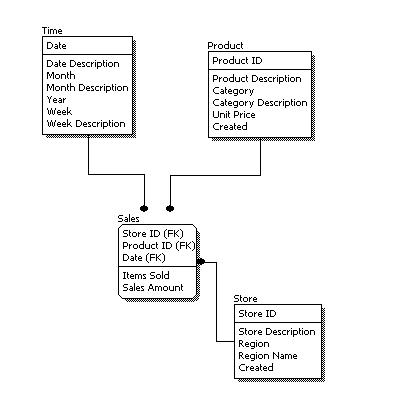

###  Постановка
Кажется Ваш вес в компании стал очень сильно вырос за последнее время. Вчера вечером в курилки Вы встретили архитектора программных продуктов. Этот задумчивый и немногословный парень сказал, что у него нет сил и времени, а нужно сделать архитектуру зоны выгрузки для корпоративного хранилища данных.

Он попросил Вас это сделать, Вы просто кивнули в ответ. Сегодня Вы смотрите в то что Вам нужно сделать, собираетесь с мыслями и приступаете к программированию.

### Задачи
- Создайте схему ods (operational data store).
- Создайте в схеме ods таблицы в третьей нормальной форме со всеми связями и индексами.
- Вам необходимо создать следующие таблицы:
    - таблица-справочник клиентов со списком полей:
        - идентификатор
        - имя
        - фамилия
        - телефон
        - дата рождения
    - таблица-справочник счетов со списком полей:
        - идентификатор
        - идентификатор клиента, которому создан счет
        - номер счета
        - дата открытия
        - дата закрытия (у открытых счетов - null)
    - таблица-справочник карт со списком полей:
        - идентификатор
        - идентификатор счета к которому прикреплена
        - номер карты
        - месяц окончания действия
        - год окончания действия
    - таблица проводок со списком полей:
        - дата
        - сумма
        - идентификатор клиента
        - идентификатор карты
- Заполнить несколько строк для тестирования.
- Сделать описание логической модели как на рисунке.

### Условия
Для успешной сдачи домашнего задания сделайте все задание, и на каждый пункт и подпункт сделайте скриншот, который после приложите в GitLab.
